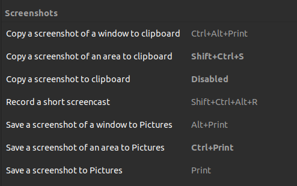

Read the install scripts for specific packages

### Brave Web Extensions

```bash
https://chrome.google.com/webstore/
- grepper
- react-developer-tools
- redux-devtools
- gitpod-always-ready-to-co
- pesticide-for-chrome-with
```

### Install Notion Desktop

```bash
# Download the unofficial .deb package from github (check if any update available, download the latest build)
https://github.com/valerie-makes/notion-linux/releases/tag/v2.0.6-windows
# Install using Ubuntu Software Install
```

### VS Code extensions

```bash
# Simply log in with github account and settings sync
# If that doesn't work
- Bracket Pair Colorizer
- Apollo Graphql
- C/C++
- Code Runner
- Draw.io Integration
- ES7+ React/Redux React-Native Snippets
- ESLint
- Excel Viewer
- Git Graph
- Github Copilot
- GitLens - Git Supercharged
- Go
- GraphQL
- Live Sass Compiler
- Live Server
- Live Share
- Markdown All in One
- Material Icon Theme
- MongoDB for VS Code
- One Dark Pro
- Prettier Code Formatter
- Prisma
- Pylance
- Python
- React Native Tools
- SQL Tools
- Tailwind CSS Intellisense
- Thunder Client
- Todo Tree
- vscode-pdf
```

### Gnome Shell Extensions

```bash
# Download the extensions zip file from the website
# Now extract the folder and copy the extracted folder to the ~/.local/share/gnome-shell/extensions directory.
# Now move inside the extension folder that you have copied and opened the metadata.json file. Locate uuid (unique identifier) entry in the metadata.json file and note down its value. Now rename the extension folder to this uuid value.
# Hit Alt+F2 keyboard shortcut and then type r and hit Enter to Restart the Gnome Shell

# List of Extensions
- Hide Top Bar:  https://extensions.gnome.org/extension/545/hide-top-bar/
```

### Discord Using Debian Pkg (AND NOT SNAP)

```bash
# Download the discord debian package using the following command.
 -wget "https://discord.com/api/download?platform=linux&format=deb" -O discord.deb

    ## If wget command is not found then proceed after executing the following command
      -sudo apt update
      -sudo apt install wget

# Now execute it using the following command and you are done.
 -sudo apt install ./discord.deb -y

```
 
### Gnome Settings

```bash
# Hide mounted disks from showing on the screen
gsettings set org.gnome.shell.extensions.dash-to-dock show-mounts false

Settings
    Appearance
        - Window Colors (Dark)
        - Auto-hide the Dock (ON)
        - Icon SIze (30)
        - Position on Screen (Bottom)

    Default Applications
        - Web (Bravea Web Browser)
        - Video (VLC Media Player)

Gnome-tweaks
    Appearance
        - Shell:         Yaru Dark      # Enable Full Dark Mode
    Extensions (ON)
        - Applications Menu
        - Hide Top Bar
        - Places Status Indicator
        - User Themes
    Themes
        - Applications:  Adwaita-dark
        - Cursor:        DMZ-Black
        - Icons:         Yaru
```

### Utilities

```bash
ps -p$$ -ocmd= # To Check current shell
```

### Keyboard Shortcuts


