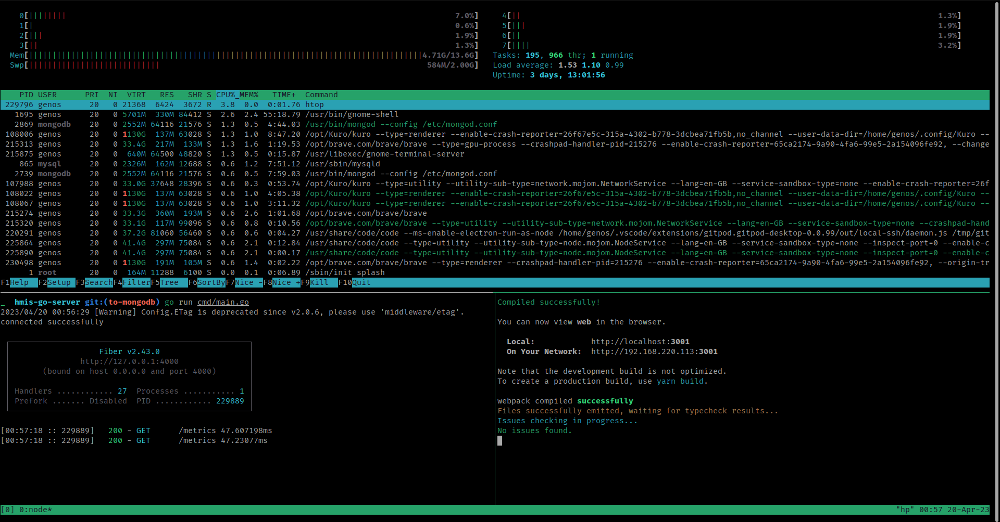

Read the install scripts for specific packages

### Automate the entire flow with
```bash
curl -X GET https://raw.githubusercontent.com/m3rashid/pc_setup/main/scripts/init.sh | bash
```

### Brave Web Extensions

```bash
https://chrome.google.com/webstore/
- grepper
- react-developer-tools
- redux-devtools
- gitpod-always-ready-to-co
- pesticide-for-chrome-with
```

### Install Notion Desktop

```bash
# Download the unofficial .deb package from github (check if any update available, download the latest build)
https://github.com/valerie-makes/notion-linux/releases/tag/v2.0.6-windows
# Install using Ubuntu Software Install
```

### Gnome Shell Extensions

```bash
# Download the extensions zip file from the website
# Now extract the folder and copy the extracted folder to the ~/.local/share/gnome-shell/extensions directory.
# Now move inside the extension folder that you have copied and opened the metadata.json file. Locate uuid (unique identifier) entry in the metadata.json file and note down its value. Now rename the extension folder to this uuid value.
# Hit Alt+F2 keyboard shortcut and then type r and hit Enter to Restart the Gnome Shell
```

### Discord Using Debian Pkg (AND NOT SNAP)

```bash
# Download the discord debian package using the following command.
 -wget "https://discord.com/api/download?platform=linux&format=deb" -O discord.deb

    ## If wget command is not found then proceed after executing the following command
      -sudo apt update
      -sudo apt install wget

# Now execute it using the following command and you are done.
 -sudo apt install ./discord.deb -y
```
 
### Gnome Settings

```bash
# Hide mounted disks from showing on the screen
gsettings set org.gnome.shell.extensions.dash-to-dock show-mounts false
```

### Utilities

```bash
ps -p$$ -ocmd= # To Check current shell
```


